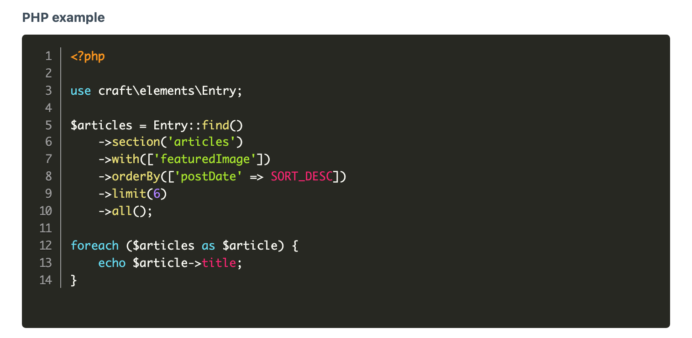

<!-- feature-intro -->
Prism gives Craft authors a code field that looks and behaves like code. Edit with live syntax highlighting, useful keyboard controls, and project-selected languages and themes, then render the stored source on the front end.
<!-- feature-intro-end -->

<!-- feature-section media-size="large" media-shadow="false" -->
## Code editing in Craft

Choose from a broad language library and see syntax highlighting as the author types. Line numbers, indentation shortcuts, undo and redo, configurable tab width, and editor height make the field suitable for more than a one-line snippet.

<!-- feature-section-end -->

<!-- feature-section -->
## Languages and themes

Select one of the bundled themes or provide a custom theme, and limit the language options to those the content model expects. The field works in Matrix, [Super Table](/craft-plugins/super-table), and Live Preview as part of a wider authoring layout.
<!-- feature-section-end -->
